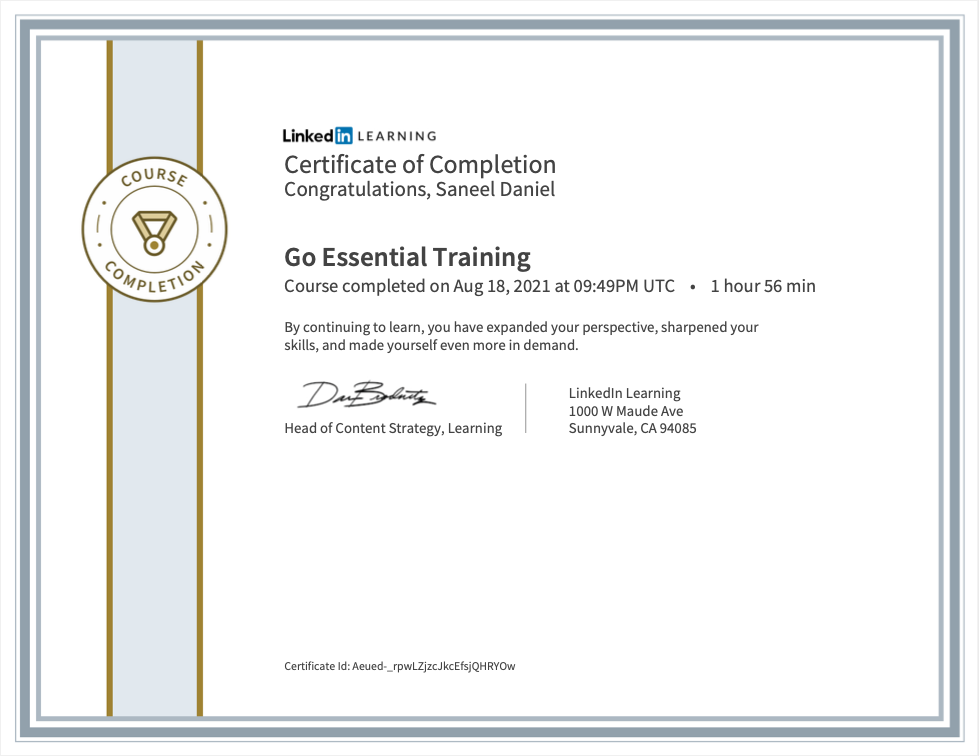

# Go Lang Learning and Certification

## What is GoLang ? 

 - Go is a statically typed, compiled programming language designed at Google by Robert Griesemer, Rob Pike, and Ken Thompson. 
 - Go is syntactically similar to C, but with memory safety, garbage collection, structural typing, and CSP-style concurrency.

## What is this repo ?

 - This repo is my basic guide to some everyday functions and syntaxes that are necessary for almost any program.

 - I have reviewed topics like 
   - data structures, 
   - data types, 
   - interfaces,
   - locks,
   - go-routines,
   - channels,
   - io,
   - networking,
   - built-in testing packages,
   - error handling / panic, 
   - http servers/rest controllers, etc.

## Certificates

